<!--
_class:
- lead
- invert
-->
# One Day Processor
## 若松俊介

---
## 工夫した点
- ループ特化の分岐予測
- メモリから1回で4つの値を取り出し
- Direct Mapped Cache(工夫あり)

---
<!--
_footer: 参考: https://en.wikipedia.org/wiki/Branch_predictor#Static_branch_prediction
-->
## ループ特化の分岐予測
- ループでは多くの場合、前の命令へ戻ることを利用
- 今回の分岐は全てルーブなので、ループ終了の数回以外当たる

---
<!--
_footer: 参考: https://www.acri.c.titech.ac.jp/wordpress/archives/6767
-->
## メモリから1回で4つの値を取り出し
- バーストモードのため、128bitを一回で読み書きする
- data_memory.vで32bit以外を捨てているのを修正して、キャッシュ

---
## Direct Mapped Cache(工夫あり)
4つの値の同時格納への対応のため、
下位2bitで格納先を分けている

---

---

## 性能
- 動作周波数: 69MHz
  - クロック周期: $1000/69 \approx 1.449$nsec
- 実行サイクル数: $126055138$ cycle
- 実行時間: $1.449 \times 126055138 \times 10^{-6} \approx 1826.9$msec
- 速度向上率: $8064.6 / 1826.9 \approx 4.414$
  - リファレンスデザインの実行時間: $8064.6$msec
