<!--
_class:
- invert
- lead
_paginate: false
-->

# DDDから学ぶ設計講習会
## @mazrean

---
# 目次

1. DDD
2. ヘキサゴナルアーキテクチャ
3. クリーンアーキテクチャ
4. デザインパターンと設計
5. 設計にできることとできないこと
6. 良い設計とは

---
<!--
_class:
- invert
- lead
_paginate: false
-->
# DDD

---
# Layered Architecture

アプリケーションを層で分割するアーキテクチャ
- UI層: ユーザーからの入出力
- Application層:
  アプリケーションならではの処理
- Domain層:
  アプリケーションで満たすべき仕様
- Infrastructure層:
  技術的な機能の実装（ex:DBへのSQL実行）

---
# Layered Architectureのメリット

層で分割されているので、ユニットテストが書きやすい。

1. 直下の層のmockを作成
1. mockを使用してテストを書く

---
# Domain Driven Design(DDD)

DDDはLayered Architectureの中のDomain層を中心にして行うアプリケーションの設計。
物凄く簡単にいうと、仕様に従うコードを書ける設計をするべき、ということ。

---
# Layered Architectureの問題点

Domain層**が**Infrastructure層に依存

- Infrastructure層でDomain層のルールが守られない可能性
- Domain層のルールをInfrastructure層をもとに決めてしまいやすい

つまり、愚直に実装するとDDD的に良くない！

---
# 解決策

Domain層とInfrastructure層の依存関係を逆にすれば解決する

---
# Dependency Injection(DI)

間にinterfaceを挟むことで、
依存の向きを逆にできる

---
# DI Container

interfaceにclass(Goならstruct)を割り当てるコードを自動生成するツール。

Javaの[Spring Boot](https://spring.io/projects/spring-boot)のやつが有名。
Goの場合、[wire](https://github.com/google/wire)を使うことが多い。

---
<!--
_class:
- lead
-->

---
# DDDの基本形

Layered Architectureに
DIでDomain層とInfrastructure層の依存を逆転させるのが
DDDの基本形

---
# Domain

Domainには3種類存在する

- Entity
- Value Object
- Service

---
# 例として使うアプリケーション

シンプルなチャットアプリ。
ユーザーがメッセージを投稿できる。

---
# Service

ものに紐づかない操作。

ex) メッセージの投稿。

---
# Entity

概念として識別が可能なドメイン。

ex) User,Message
@mazreanと@tokiは別のユーザー。

---
# Value Object

概念として識別ができないドメイン。

ex) ユーザー名
mazreanという文字列のユーザー名と、
tokiという文字列のユーザー名はそれ自体で識別することはない。
ユーザーになって初めて識別ができるものになる。

---
# 演習: traP CollectionのDomainを見てみよう
時間: 2min
traP CollectionのサーバーサイドはDDDベースのアーキテクチャになっている。ドメインを見てみよう!
https://github.com/traPtitech/trap-collection-server

- Entity: src/domain直下
- Value Object: src/domain/value以下
- Service: src/service**直下**

