<!--
_class:
- invert
- lead
_paginate: false
-->

# DDDで学ぶ設計講習会
## @mazrean

---
# 目次

1. DDD
2. Hexagonal Architecture
3. Clean Architecture
4. デザインパターンとアーキテクチャ
5. 設計にできることとできないこと
6. 良い設計をするために

---
# 注意

今回の講習会での各アーキテクチャの説明は
以下の書籍・Webサイトをベースにしています
(詳細情報は参考文献に書いています)

- DDD: エリック・エヴァンスのドメイン駆動設計
- Hexagonal Architecture: [Hexagonal architecture – Alistair Cockburn](https://alistair.cockburn.us/hexagonal-architecture/)
- Clean Architecture: [The Clean Architecture - The Clean Code Blog](https://blog.cleancoder.com/uncle-bob/2012/08/13/the-clean-architecture.html)

---
<!--
_class:
- invert
- lead
_paginate: false
-->
# DDD

---
# Layered Architecture

アプリケーションを層で分割するアーキテクチャ
- UI層: ユーザーからの入出力
- Application層:
  アプリケーションならではの処理(ビジネスロジック)
- Domain層:
  アプリケーションで満たすべき仕様
- Infrastructure層:
  技術的な機能の実装（ex:DBへのSQL実行）

---
# Layered Architectureのメリット

層で分割されているので、ユニットテストが書きやすい。

1. 直下の層のmockを作成
1. mockを使用してテストを書く

---
# Domain Driven Design(DDD)

DDDはLayered Architectureの中のDomain層を中心にして行うアプリケーションの設計。
物凄く簡単にいうと、「仕様に従うコードを書ける設計をするべき」ということ。

---
# Layered Architectureの問題点

Domain層**が**Infrastructure層に依存

- Infrastructure層でDomain層のルールが守られない可能性
- Domain層のルールをInfrastructure層をもとに決めてしまいやすい

つまり、愚直に実装するとDDD的に良くない！

---
# 解決策

Domain層とInfrastructure層の依存関係を逆にすれば解決する

---
# Dependency Injection(DI)

間にinterfaceを挟むことで、
依存の向きを逆にできる

---
# 注意点

interfaceの定義時には依存される側(今回ならInfrastructure)の
データしか使ってはいけない

---
# DI Container

interfaceにclass(Goならstruct)を割り当てるコードを自動生成するツール。

Javaの[Spring Boot](https://spring.io/projects/spring-boot)のやつが有名。
Goの場合、[wire](https://github.com/google/wire)を使うことが多い。

---
<!--
_class:
- lead
-->

---
# Layered Architecture with DI

DIでLayered ArchitectureのDomain層とInfrastructure層の依存を逆転させる

---
# メリット

- 仕様がコード全体で守られる
- 技術が変わっても仕様に関するコードを変えずに済む
  - 変化の速度は基本$技術 \gg 仕様$
    →変更が大幅に削れる

---
# Domain

Domainには3種類存在する

- Entity
- Value Object
- Service

---
# 例として使うアプリケーション

シンプルなチャットアプリ。
ユーザーがメッセージを投稿できる。

---
# Service

ものに紐づかない操作。

ex) メッセージの投稿。

---
# Entity

概念として識別が可能なドメイン。

ex) User,Message
@mazreanと@tokiは別のユーザー。

---
# Value Object

概念として識別ができないドメイン。

ex) ユーザー名
mazreanという文字列のユーザー名と、
tokiという文字列のユーザー名はそれ自体で識別することはない。
ユーザーになって初めて識別ができるものになる。

---
# 演習: Domainを見てみよう
時間: 2min
traP CollectionのサーバーサイドはDDDベースのアーキテクチャになっている。ドメインを見てみよう!
https://github.com/traPtitech/trap-collection-server

- Entity: src/domain直下
- Value Object: src/domain/value以下
- Service: src/service**直下**

---
<!--
_class:
- invert
- lead
_paginate: false
-->
# Hexagonal Architecture

---
# Hexagonal Architecture

DDDに対称性という考えを加えたもの
Port, Adapterという見方が特徴

---
# Layered Architecture→Hexagonal Architecture

- **InfrastructureがApplicationに依存**
- Domainへの言及がない

---
# メリット

- 対称性
- Port, Adapterという見方のイメージしやすさ

---
# 対称性

**Hexagonal** Architectureという名前の由来

- 対象である方が層の境界が分かりやすい
- 3つ以上の外部アプリケーションが存在する場合のイメージがしやすい
  - Layered Architectureの図は2方向

---
# Port, Adapter

異なる接続口を持つ外部アプリケーションを
アプリケーションの用意したPortに合うように
Adapterで変換してPortに繋ぐ

---
# Port, Adapter

USB Type-Aのマウス(外部アプリケーション)を
USB Type-CへAdapterで変換して
PC(アプリケーション)に接続するイメージ

---
# 演習: Port, Adapterを見てみよう
時間: 2min
traP CollectionのサーバーサイドにもPort, Adapterの構造が存在する。
(Hexagonal Architectureではない)
repository(データ永続化)のPort, Adapterを見てみよう!
https://github.com/traPtitech/trap-collection-server

- Port: src/repository**直下**
- Adapter:
  - src/repository/gorm直下
  - src/repository/mock直下(`go generate`すると生成されます)

---
<!--
_class:
- invert
- lead
_paginate: false
-->
# Clean Architecture

---
<!--
_footer: 引用：[The Clean Architecture 13 August 2012 - Clean Coder Blog](https://blog.cleancoder.com/uncle-bob/2012/08/13/the-clean-architecture.html)
-->
# Clean Architecture

Hexagonal ArchitectureやOnion Architectureなどを統合して、
より実用的にしようとしたもの

---
# Layered Architecture→Clean Architecture

Domainが消えていないHexagonal Architecture

---
# メリット

DDDのメリット+Hexagonal Architectureのメリット

- 仕様がコード全体で守られる(DDD)
- 技術が変わっても仕様に関するコードを変えずに済む(DDD)
- 対称性(Hexagonal Architecture)

---
# DDD関連のアーキテクチャの関係

---
<!--
_class:
- invert
- lead
_paginate: false
-->
# 休憩
## 10min

---
<!--
_class:
- invert
- lead
_paginate: false
-->
# デザインパターンとアーキテクチャ

---
# デザインパターン

設計時によく現れる構造のパターン。
オブジェクト指向のパターンについて述べたGoFのものが有名。

以下のものを例として説明する

- Abstract Factory Pattern
- Adapter Pattern

---
# Abstract Factory Pattern

オブジェクトの生成と使用を分離するためのパターン。
依存関係の逆転を実現するもう1つの方法。
ただし、DI Containerがあれば基本DIの方が楽。

---
# Adapter Pattern

欲しいinterfaceに合わないライブラリなどのinterfaceを、
欲しいinterfaceに合わせるデザインパターン

---
<!--
_footer: 引用：[The Clean Architecture 13 August 2012 - Clean Coder Blog](https://blog.cleancoder.com/uncle-bob/2012/08/13/the-clean-architecture.html)
-->
# Hexagonal ArchitectureとAdapter Pattern

class、interfaceの名前に注目。
Hexagonal ArchitectureのPort・Adapterの考えは、
Adapter Pattern由来であることがわかる。

---
# デザインパターンのデメリット

デザインパターンを使うと通常構造が複雑になる

---
# デザインパターンの使い方

デザインパターンは問題解決の手段。

誤: 使えるから使う
正: 〜という問題を解決できるから使う

デザインパターンは問題を明確にした上で使うべき。

---
# デザインパターンとアーキテクチャ

多くのアプリケーションで発生する問題が存在する。
ex) 外部サービスのアップデートに追従しやすくしたい

これに対処できるようなデザインパターンなどの組み合わせがアーキテクチャ

---
<!--
_class:
- invert
- lead
_paginate: false
-->
# 設計にできることとできないこと

---
# 設計の目的

最終的な目的は「開発の円滑化」
そのために、アプリケーションに適した

- 柔軟さ
- 複雑さ
- 開発速度

などを実現するのが目的

---
# トレードオフ

柔軟さを生み出す手段としてAdapter Patternを使う場合
- interfaceに適合させるための構造体から構造体への変換が発生
  →コード量増加
  →開発速度低下
- interfaceについての理解が必要
  →複雑化

欲しい項目全てを実現することはできない！

---
# 設計でやるべきこと

トレードオフのバランスを見て、
アプリケーションに適した

- 柔軟さ
- 複雑さ
- 開発速度

などのバランスを実現すること

---
<!--
_class:
- invert
- lead
_paginate: false
-->
# 良い設計をするために

---
# 設計の目的

最終的な目的は「開発の円滑化」
そのために、アプリケーションに適した

- 柔軟さ
- 複雑さ
- 開発速度

などのバランスを実現するのが目的
→適切なバランスについて考えるべき

---
# バランスの考え方

自分の場合、以下のような流れで行なっている

1. 将来起こりうる作業を予想する
1. 要求の洗い出し
1. 要求にあったアーキテクチャを選択
1. 適用するとより適した構造となりそうなデザインパターンなどを適用

---
# traP Collectionの場合

- ストレージの変更
- API設計の修正

を予定していた。
逆に仕様は長年話していてそれなりに固まっていた。
Clean Architectureをベースにした。

各層の中で細かく共通化したい部分が発生しそうだったので、
そのような部分を構造体で切り出して委譲するようにした。

---
# アーキテクチャの学び方

自分は以下のステップが良いと考えている

1. アーキテクチャの原典をなんとなく理解
1. アーキテクチャの前提となっている知識の理解
1. 要素へ分解して、同じアーキテクチャを組み上げるイメージをする
1. アーキテクチャの原典を理解

---
# よくある疑問

Q. interfaceはどのぐらい抽象化すべき？
A. 想定される変更に対するコストが最小になる程度

Q. Clean Architectureするとコード量が増えて辛い
A. 規模に対してClean Architectureではオーバースペックな可能性大

---
# まとめ

アーキテクチャを使う際には

- しっかり理解した上で
- アプリケーションに適切か考える

という流れを踏むと良い

---
# 最後に

長いものでなくて良いので、講習会をやってみてください！

- 知識が整理できる
- 興味がある分野に周りが興味を持ってくれて、刺激を受けられる可能性が上がる
- やっていた仕事を周りに任せられる

など、良いことが無限にあります。

---
# 参考文献
- Eric Evans (著), 和智右桂  (翻訳), 牧野祐子 (翻訳), 今関剛 (監修)「エリック・エヴァンスのドメイン駆動設計」, 翔泳社, 2011/4/9
- Alistair Cockburn「Hexagonal architecture」, https://alistair.cockburn.us/hexagonal-architecture/ (2022/1/22)
- Clean Coder Blog「The Clean Architecture」, https://blog.cleancoder.com/uncle-bob/2012/08/13/the-clean-architecture.html (2022/1/22)
