<!--
_class:
- lead
- invert
-->
# Significant Duplication 検出実装
## 若松俊介

---
## Significant Duplication
コードの重複の中で特に影響の大きいもの。

- できる限り大きいまとまり
- 十分大きい

---
## Size of Exact Clone
コードの重複の大きさ。
重複が十分大きいかの判定で使用。

### 条件
- 重複単体の場合  
  - $SEC > AVERAGE(LOC/operation)$
  - $AVERAGE(LOC/operation)$は手動設定
- 複数の重複のまとまりの場合
  - $SEC > FEW$

---
## Line Bias
コードの重複間の距離。
重複が1つの塊かの判定で使用。

### 条件
- $LB \leq FEW$

---
## Size of Duplication Chain
重複の塊の大きさ。
コードの塊が十分大きいかの判定で使用。

### 条件
- $SDC \geq 2\times(FEW+1)+1$
  - 各重複が$FEW$より長い
  - 重複間の隙間分として$+1$

---
## コードの重複検出
メトリクスの取り出しの前処理。
ASTを元にSuffix Treeを構築する手法を使用。

1. AST構築
1. AST→ノードの列
1. ノードの列→Suffix Tree
1. Suffix Tree→ノード列の重複
1. ノード列の重複→コードの重複

---
## AST→ノードの列
ポーランド記法のイメージ。
各ノードに子ノード数を紐づけるのがポイント。

---
## Suffix Tree
接尾辞(文字列の最後$N$文字)を木構造にしたもの。
文字数$N$として時間計算量$O(N)$で構築可能。
例)banana

---
## Suffix Tree→コードの重複
Suffix Treeの深さ優先探索で検出可能。
時間計算量$O(N)$。

---
## ノード列の重複→コードの重複
子ノードの数を元にノード列を切っていく。

---
<!--
_class:
- lead
- invert
-->

# 実演

---
## 課題
- コードクローンをペアにする処理
  - 現在$O(N^3)$になっており、非常に遅い
- テスト整備
  - テストがないのでバグが眠っていそうで怖い

---
## リポジトリ
- コードクローン検出ライブラリ: [mazrean/go-clone-detection](https://github.com/mazrean/go-clone-detection)
- Significant Duplication検出ツール: [mazrean/sdsniffer](https://github.com/mazrean/sdsniffer)

---
## 参考文献
- [Rainer Koschke and Raimar Falke, Clone Detection Using Abstract Syntax Suffix Trees, 13th Working Conference on Reverse Engineering (WCRE 2006), 23-27 October 2006](https://www.researchgate.net/publication/221200051_Clone_Detection_Using_Abstract_Syntax_Suffix_Trees)
