<style>
	:root {
		--color-background: #f2f4f7;
		--color-foreground: #111f4d;
		--color-highlight: rgba(17, 31, 77, 0.5);
		--color-dimmed: #757575;
	}
	:root.invert {
		--color-background: #111f4d;
		--color-foreground: #f2f4f7;
		--color-highlight: rgba(17, 31, 77, 0.5);
		--color-dimmed: #757575;
	}
	.gist {
		height: 400px !important;
	}
	.gist-file .gist-data {
		max-height:400px;
		overflow-y: visible;
	}
</style>
<!--
_class:
- lead
- invert
_paginate: false
-->
# GenORM実装解説
## @mazrean
### #traP_LT

---
## mazrean


- 情報工学系 B3
- 趣味: 百合漫画
- SysAd班
- traP Collection サーバーサイドリーダー
- CPCTF2021 インフラ・Webshell担当
- [GenORM](https://zenn.dev/mazrean/articles/c795c04e4837b4) ← 今日話すやつ

---
## GenORM

Go言語のSQL Builder。
ジェネリクスを使って

- 対象テーブルのカラムのみ使用可能
- Goの型が同一の値のみ比較可能

のような制約をかけている
→SQLのミスを防げる!

---
## 例1

```go
// 実行可能
// SELECT * FROM users WHERE users.name="name"
userValues, err := genorm.
	Select(orm.User()).
	Where(genorm.EqLit(user.NameExpr, genorm.Wrap("name"))).
	GetAll(db)

// コンパイルエラー(stringとintを比較)
// SELECT * FROM users WHERE users.name=1
userValues, err := genorm.
	Select(orm.User()).
	Where(genorm.EqLit(user.NameExpr, genorm.Wrap(1))).
	GetAll(db)
```

---
## 例2

```go
// 実行可能
// SELECT * FROM users WHERE users.id="{{userID}}"
userValues, err := genorm.
	Select(orm.User()).
	Where(genorm.EqLit(user.IDExpr, userID)).
	GetAll(db)

// コンパイルエラー(messagesテーブルのカラム使用)
// SELECT * FROM users WHERE messages.id="{{messageID}}"
userValues, err := genorm.
	Select(orm.User()).
	Where(genorm.EqLit(message.IDExpr, messageID)).
	GetAll(db)
```

---
## 仕組み

SQLのExpressionに型パラメーターで
- テーブル
- Goの型

の情報を持たせる
```go
func EqLit[T Table, S ExprType](
	expr TypedTableExpr[T, S],
	literal S,
) TypedTableExpr[T, WrappedPrimitive[bool]] {
	// 省略
}
```

---
<!--
_class:
- lead
- invert
_paginate: false
-->

# 実装解説

---
## ツールの構成

CLIとライブラリで構成される。

### 使用の流れ
1. スキーマを設定ファイル(Go)に書く
2. CLIでコード生成
3. ライブラリでSQLを構築&実行

---
## コード生成の流れ

1. スキーマ解析 - ASTからグラフ作成
2. Join後のテーブル計算
3. コード生成 - ASTを構築、コードへ



---
## ASTでコード生成する

リリース前のバージョンのコードを生成
→`go/ast`をそのまま使って生成

1. ASTを構築
2. `go/format`の`format.Node`でコード生成

---
## importを整理する

- 使わないimportがあるとエラー
- importの管理自前でやりたくない…

→`golang.org/x/tools/imports`

---
## importを整理する

`imports.Process`を呼ぶだけでimportを削れる
```go
// codeBytes: import整理前
// newCodeBytes: import整理後
newCodeBytes, err := imports.Process("", codeBytes, nil)
```

---
## ライブラリとコード生成の繋ぎこみ

ミスが発生しやすい部分
→ライブラリのinterfaceを関数で表現

```go
func typedTableExpr(tableType ast.Expr, exprType ast.Expr) ast.Expr {
	return &ast.IndexListExpr{
		X: &ast.SelectorExpr{
			X:	 genormIdent,
			Sel: ast.NewIdent("TypedTableExpr"),
		},
		Indices: []ast.Expr{
			tableType,
			exprType,
		},
	}
}
```

---
## 使用する際の流れ

1. テーブル構築 - 生成コードベース
2. クエリ構築 - ライブラリベース


---
## テーブル構築とクエリ構築の繋ぎこみ

プロトタイプ
```go
messageUserValues, err := orm.User().
	Message().Join(genorm.Eq(userIDExpr, messageUserID))
	Select().
	Fields(userName, messageContent).
	GetAll(db)
```

---
## テーブル構築とクエリ構築の繋ぎこみ

現在
```go
table := orm.User().
	Message().Join(genorm.Eq(userIDExpr, messageUserID))
messageUserValues, err := genorm.
	Select(table).
	Fields(userName, messageContent).
	GetAll(db)
```

---
## Methodの型パラメーター

GoのGenericsではMethodに型パラメーターを持たせられない
参考: [Type Parameters Proposal](https://go.googlesource.com/proposal/+/refs/heads/master/design/43651-type-parameters.md#no-parameterized-methods)
```ebnf
/* ref: https://go.dev/ref/spec#Function_declarations */
FunctionDecl = "func" FunctionName [ TypeParameters ] Signature [ FunctionBody ] .
```
```ebnf
/* ref: https://go.dev/ref/spec#Method_declarations */
MethodDecl = "func" Receiver MethodName Signature [ FunctionBody ] .
```

---
## Pluck

Expression指定でSELECTする
結果としてExpressionのGoの型の値を返す
→Pluckには型パラメーターが必須
```go
// SELECT id FROM users
// userIDs: []uuid.UUID
userIDs, err := genorm.
	Pluck(orm.User(), user.IDExpr).
	GetAll(db)
```

---
## SELECTでの構造体作成

初期: `T`がポインターなので、無理やりメモリ確保
```go
func (c *SelectContext[T]) GetCtx(ctx context.Context, db DB) (T, error) {
	var table T
	// 省略
	iTable := table.New() // Table型を返す
	switch v := iTable.(type) {
	case T:
		table = v
	default:
		return table, fmt.Errorf("invalid table type: %T", iTable)
	}
	// 省略
	return table, nil
}
```

---
## SELECTでの構造体作成

現在: 型パラメーター`S`で`T`の先の型取得
```go
type SelectContext[S any, T TablePointer[S]] struct {
	//省略
}
func (c *SelectContext[S, T]) GetCtx(ctx context.Context, db DB) (T, error) {
	//省略
	var table S
	//省略
	return &table, nil
}
```

---
## 制約型推論

使う時に`S`指定しないでいいの？
→制約型推論


---
## 型推論

Go 1.18時点のGenericsの型推論は2種類

- 関数引数型推論(Function argument type inference)
	- `func hoge[T any](t T)`で`func hoge(1)`
		→`T`は`int`
- 制約型推論(Constraint type inference)

---
## 制約型推論

関数引数型推論の結果を使用してさらに型推論する
- `T`は`*orm.UserTable`
- `S`は`orm.UserTable`

```go
type TablePointer[T any] interface {
	Table
	*T
}

func Select[S any, T TablePointer[S]](table T) *SelectContext[S, T]{
	// 省略
}
```


---
## ジェネリクスとgomock

現在、gomockで型パラメーターを含むmockは生成できない
interfaceが型パラメーターを持たなくても、
生成できない場合がある

参考: https://github.com/golang/mock/issues/621

---
## gomockがファイルをparseする流れ

1. import先packageのinterfaceとidentifierのmap作成
	- **interfaceの中身までは見ない**
2. ファイル内のinterfaceを全てparse
	- ここでは全interfaceの中身を見る
	- interfaceをembedしている場合、1のmapからとりだして中身を見る

---
## gomockが動かない条件

以下のいずれかで落ちる

- ファイルのinterfaceに型パラメーターがある
- embedされているinterfaceに型パラメーターがある

---
## GenORMの事例

Expr自体は型パラメーターがないが、
TableExprに方パラメーターがあるのでmockできない

```go
type Expr interface {
	Expr() (string, []ExprType, []error)
}

type TableExpr[T Table] interface {
	Expr
	TableExpr(T) (string, []ExprType, []error)
}
```

---
## 回避方法

- 型パラメーターがないinterfaceだけ分ける
	→可読性の観点であまりやりたくない
- 別ファイルでembed
	GenORMでは`genorm_test`パッケージに置いている
	```go
	type Expr interface {
		genorm.Expr
	}
	```

---
## WrappedPrimitiveのScan

Scanのみ型ごとに処理が分かれる
```go
type ExprPrimitive interface {
	bool |
		int | int8 | int16 | int32 | int64 |
		uint | uint8 | uint16 | uint32 | uint64 |
		float32 | float64 |
		string | time.Time
}

type WrappedPrimitive[T ExprPrimitive] struct {
	valid bool
	val	 T
}
```

---
## 型パラメーターでのswitch

できるならそもそも型を分けて対応するべき
GenORMの場合、分けると使い勝手が悪くなるので分けたくない

書きたいやつ(できない)
```go
func (wp *WrappedPrimitive[T]) Scan(src any) error {
	switch T {
	case bool:
		//省略
	}
	// 省略
}
```

---
## 型パラメーターでのswitch

繰り返しですが、やらないで良いならやらない方が良い

力技対応
```go
func (wp *WrappedPrimitive[T]) Scan(src any) error {
	var dest any = wp.val
	switch dest.(type) {
	case bool:
		//省略
	}
	// 省略
}
```

---
## `database/sql`の`Null~`

ジェネリクスの使い道として真っ先に考えたんじゃないかと思う
本当にジェネリクスの使いいどころなのか？と言う疑問が出てくる

こうなる？
```go
func (n *NullValue[T]) Scan(value any) error {
	var dest any = wp.val
	switch dest.(type) {
	case bool:
		//省略
	}
	// 省略
}
```

---
## `database/sql`の`Null~`

おそらくジェネリクス使ってok(実際にされるかは不明)
現在でも`any`に変換しているので、速度低下は起きなさそう

```go
func (n *NullInt16) Scan(value any) error {
	// 省略
	err := convertAssign(&n.Int16, value)
	n.Valid = err == nil
	return err
}

func convertAssign(dest, src any) error {
	// 省略
}
```

---
<!--
_class:
- lead
- invert
_paginate: false
-->

# 今後の展望

---
## 静的解析

Goの構文中に全SQLが現れる
→Goの構文とSQLの構文を組み合わせた解析が可能

- N+1問題
- 集計関数

```go
userValues, err = genorm.
	Select(orm.User()).
	Fields(user.Name).
	GroupBy(user.Name).
	Having(genorm.GtLit(genorm.Count(user.IDExpr, false), genorm.Wrap(int64(10)))).
	GetAll(db)
```

---
## 対応SQL増加

性質上、対応可能なSQLが非常の多い

カラム名以外でのSELECT,etcもできるようにしたい
```go
tuplValues, err = genorm.
	Find(orm.User(), genorm.Tupl(user.NameExpr, genorm.Count(user.IDExpr, false))).
	GroupBy(user.Name).
	GetAll(db)
```

---
<!--
_class:
- lead
- invert
_paginate: false
-->
## 目標

## SQLの実行時エラー0

---
<!--
_class:
- lead
_paginate: false
-->
# Thank you for listening
